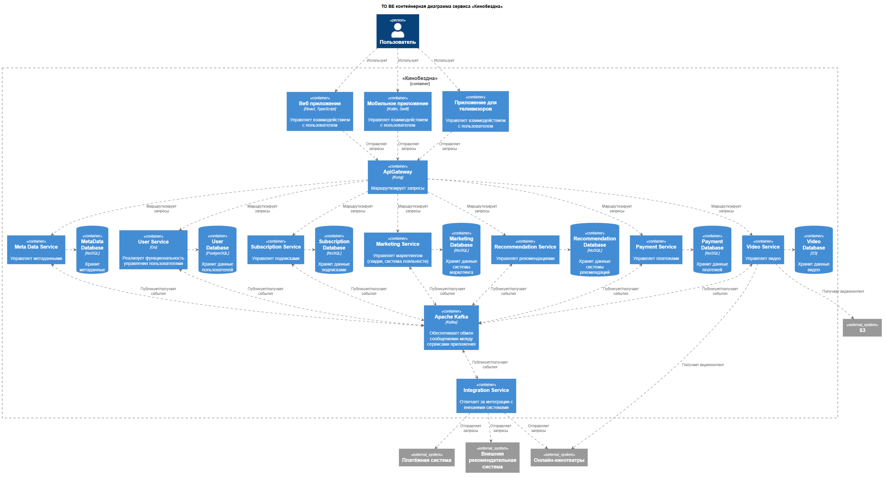
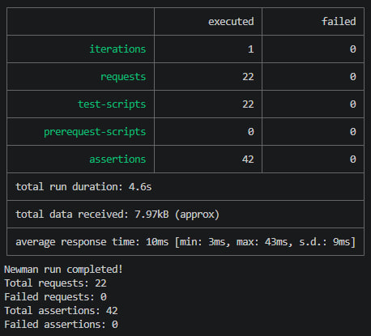
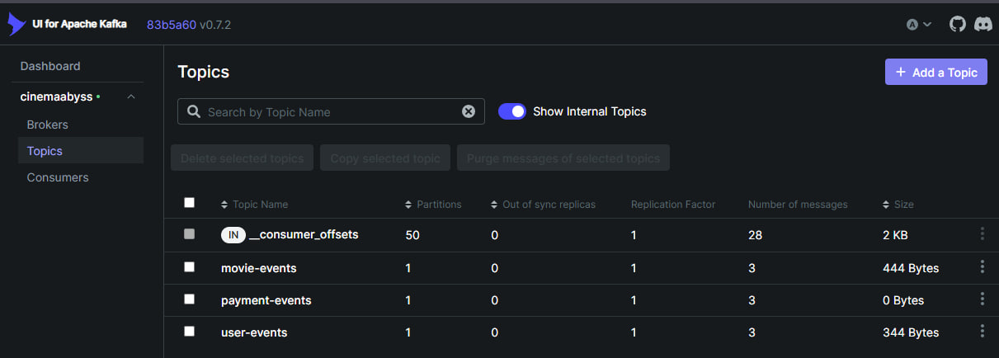
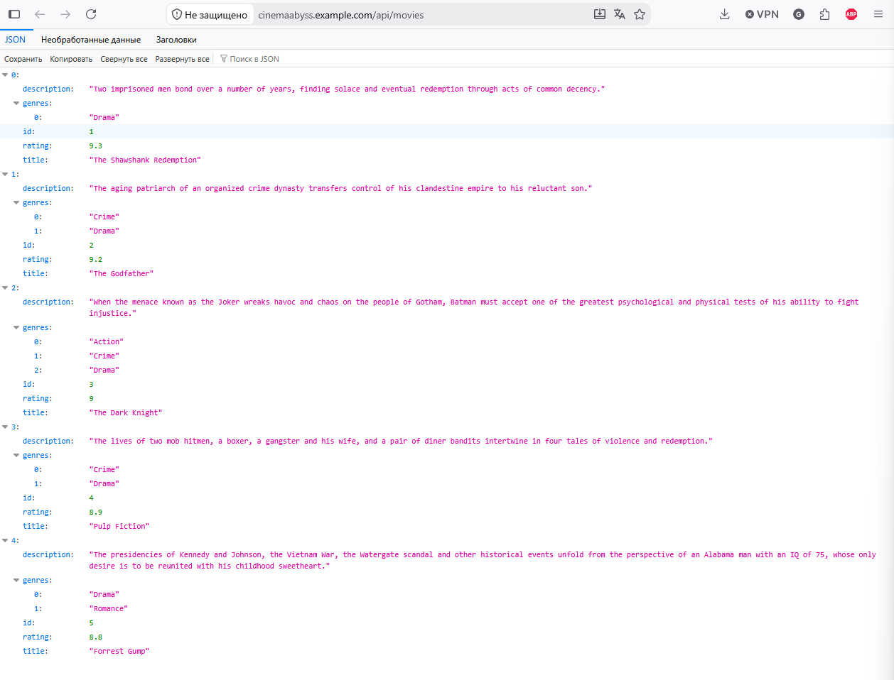
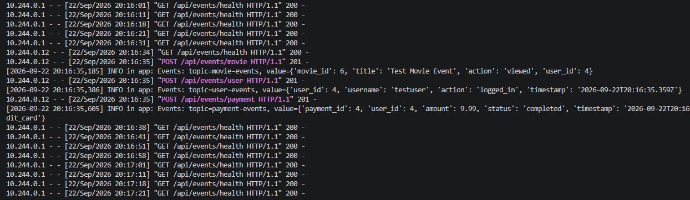
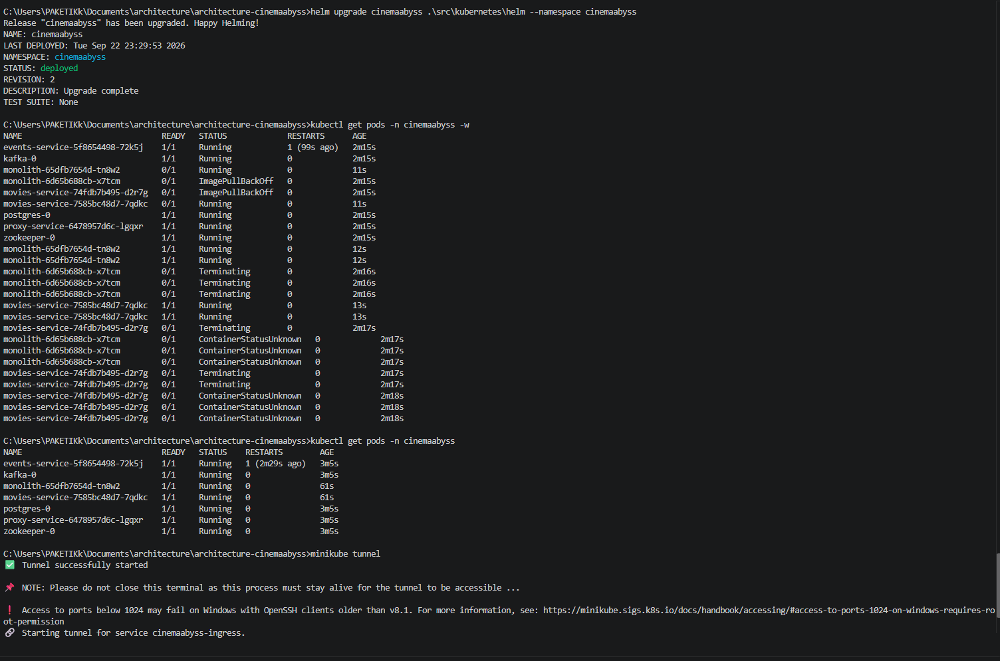
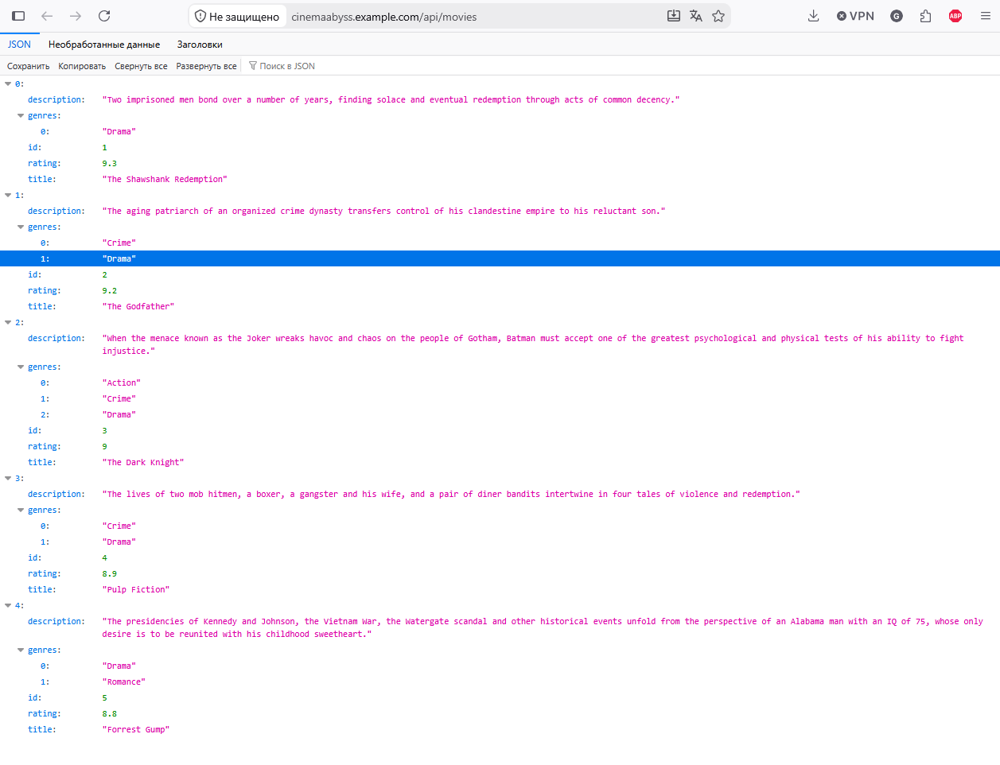

## Изучите [README.md](.\README.md) файл и структуру проекта.

# Задание 1

[container-to-be.puml](diagrams/container-to-be.puml)

# Задание 2

Events Service - [./src/microservices/events/app.py](src/microservices/events/app.py)

Proxy Service - [./src/microservices/proxy/app.py](src/microservices/events/app.py)

# Задание 3

# Задание 4

